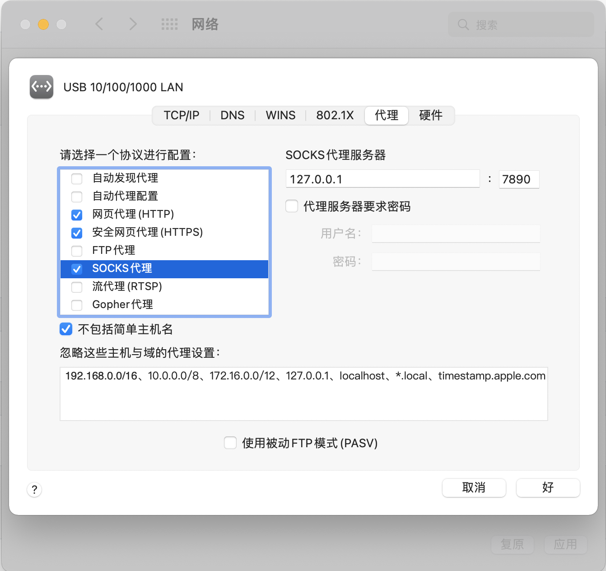

##  MacOS  clash 科学上网设置（命令行版）


### 前言

本项目中使用的`clash`的配置文件仅供演示，请自行购买支持`clash`的机场服务，下载其提供的配置文件，并改名为`config.yaml`

重点：**下载其提供的配置文件，并改名为`config.yaml`**

重点：**下载其提供的配置文件，并改名为`config.yaml`**

重点：**下载其提供的配置文件，并改名为`config.yaml`**

### 步骤

```bash
git clone xxxxxxx
cd xxxx
chmod +x install.sh
./install.sh # 如提示权限不足，则 sudo ./install
```

### 用法

#### 一、clash

- **启动clash**

```bash
launchctl start clash
```

- **停止clash**

```bash
launchctl stop clash
```

- **查看clash 是否开启**

```bash
launchctl list | grep clash
或
ps aux | grep clash
```


#### 二、设置代理

- 在系统网络设置中设置代理

  类型：`socks5`

  地址： `127.0.0.1`

  端口：`7891`

  

- 在终端中设置代理

  想当前使用的`.zshrc`或`.bashrc`写入以下内容：

  ```bash
  alias proxy="export https_proxy=http://127.0.0.1:7890 http_proxy=http://127.0.0.1:7890 all_proxy=socks5://127.0.0.1:7891 && source ~/.zshrc"
  alias noproxy="unset https_proxy http_proxy all_proxy && source ~/.zshrc"
  ```

```bash
source ~/.zshrc
```

`proxy` 设置代理

`noproxy`取消代理


### Web管理

地址：

```bash
http://127.0.0.1:9090/ui
```

密码为空

